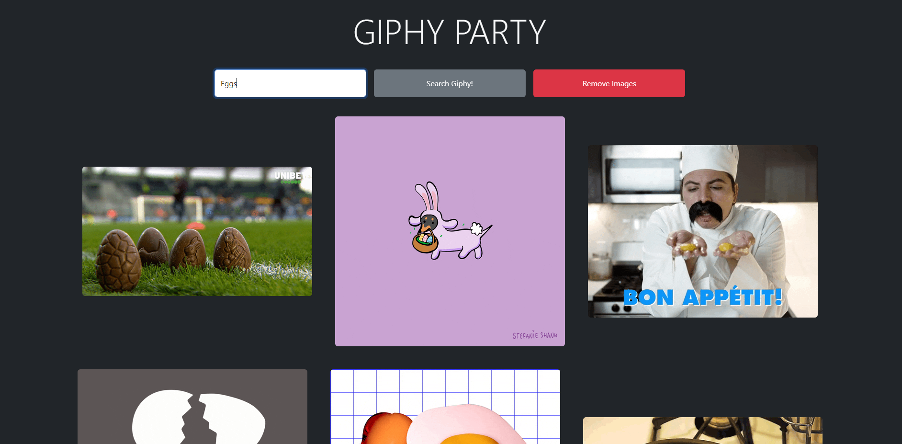

# Giphy Party
GIF search form using Giphy API to generate a GIF using user input. Handles invalid inputs.

Giphy API returns 50 images for each search term. This app stores in an object (gifCollection) each user's valid search term, and generates a random GIF from that object, deleting that GIF in the object when it is generated. Thus, after 50 random generations of a given search term, no more GIFs will be left in that object and an error will appear.

Users can remove all images with the Remove Images button. This also clears all keys from the gifCollection object, thus allowing a user to "start fresh."

Practiced basic layout using Bootstrap, including making the app size-responsive, collapsing the form for small screens into a column.

     

## My Contributions
This project was entirely written by me. I was given no starter code. I was only provided the Giphy API itself.
